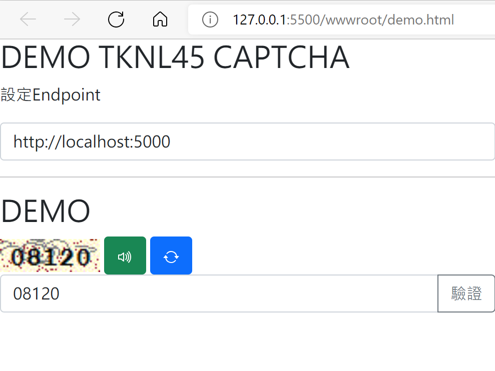

# 無狀態驗證碼

產生有1分鐘效期的圖形/聲音驗證碼

Generate a graphic/sound verification Captcha with a validity period of 1 minute 

## 相關API

* [GET] captcha/token 取得含有驗證碼的加密字串
* [GET] captcha/img?token=2xZUiAG...  傳入token產生驗證碼圖檔
* [GET] captcha/audio?token=2xZUiAG...  傳入token產生驗證碼音檔(無雜訊)

## demo

1. donet run
2. 請打開wwwroot/demo.html
3. 測試

## 參考文獻
* [设计一种无状态的验证码](https://monkeywie.cn/2020/03/26/stateless-captcha/)
* [簡單實做Captcha (完全用.Net內建函式) ](https://dotblogs.com.tw/kennyshu/2009/11/09/11504 )
* [使用 AES 演算法為字串加密解密](https://dotblogs.com.tw/jwpl102216/2016/10/23/120443)